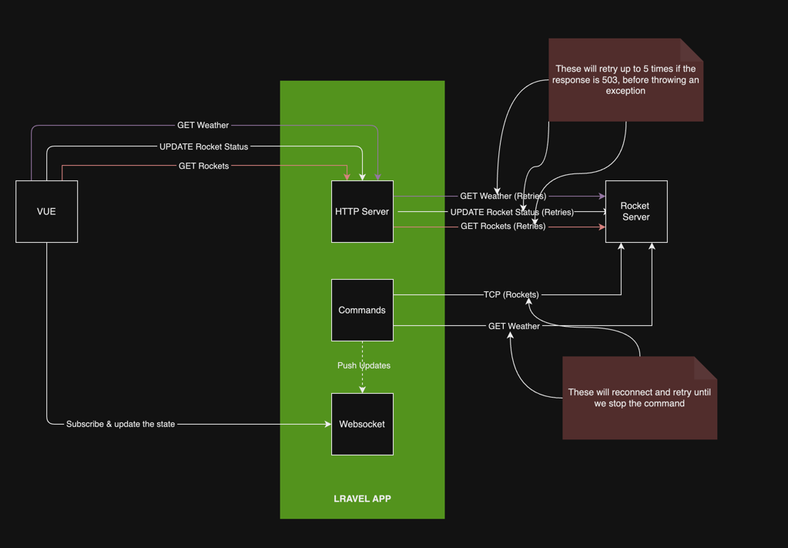

# Rockets


# Workflow


### Installation
```bash
git clone https://github.com/naythukhant/rockets.git
cd rockets
cp .env.example .env
composer install
php artisan key:generate
php artisan migrate # We do not use the database, but just to keep it as the framework's default
npm install
npm run build
```

### Configuration (Environment Variables)
```dotenv
ROCKET_BASE_URI=http://localhost:5000# Rocket Base URI provided by docker image (dreamci11/rocketapp:1.0.0)

TELEMETRY_MEMORY_LIMIT=50# Memory Limit for Telemetry Listener
TELEMETRY_ADDRESSES=localhost:4000,localhost:4001,localhost:4002,localhost:4003,localhost:4004,localhost:4005,localhost:4006,localhost:4007,localhost:4008# List of telementry tcp services provided by docker image (dreamci11/rocketapp:1.0.0)


REVERB_APP_ID=rockets# Websocket App ID
REVERB_APP_KEY=rockets# Websocket App Key
REVERB_APP_SECRET=rockets# Websocket App Secret
REVERB_PORT=8080# Websocket Port
REVERB_HOST=localhost# Websocket Host
REVERB_SCHEME=http

VITE_REVERB_APP_KEY=${REVERB_APP_KEY}
VITE_REVERB_HOST=${REVERB_HOST}
VITE_REVERB_PORT=${REVERB_PORT}
VITE_REVERB_SCHEME=${REVERB_SCHEME}

VITE_BASE_URL=${APP_URL}/api# API service provided by Larvel, You may want to take a look at APP_URL in .env file
```

### Running the application


```bash
  # This command must be run where the docker compose file is located
  docker compose up -d # Start telemetry services (HTTP & TCP servers)
```

```bash
# Run the following commands in different terminals, under Laravel Application Root
php artisan serve
php artisan reverb:start # Important, without this, telemetry:start and weather:listen wont work
php artisan telemetry:start
php artisan weather:listen
```
